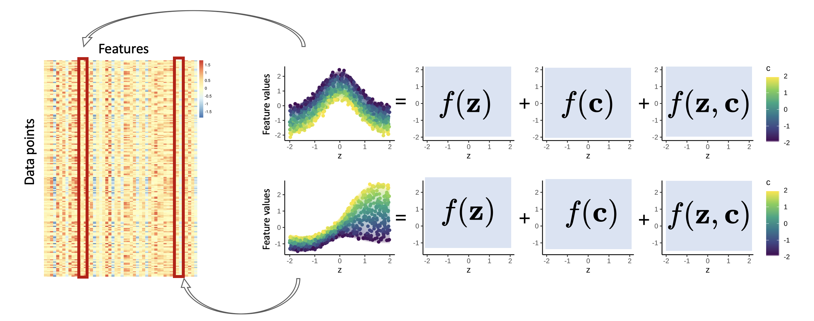
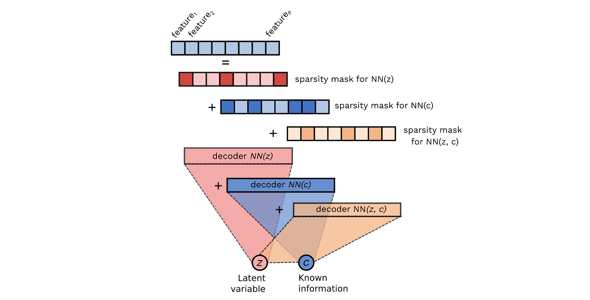

# NeuralDecomposition

This is a PyTorch implementation of our AISTATS paper [Neural Decomposition: Functional ANOVA with Variational Autoencoders](https://arxiv.org/abs/2006.14293) (Märtens & Yau, 2020)

### Example Colab notebook

See the Colab noteboook for an example on synthetic data:

* [open in GitHub](toy_example.ipynb)
* [open in Colab](https://colab.research.google.com/github/kasparmartens/NeuralDecomposition/blob/master/toy_example.ipynb)

### Implementation 

* [`decoder.py`](ND/decoder.py) impements the class for the decomposable CVAE decoder, for the special case of a one-dimensional latent variable *z* and one-dimensional covariate *c*.
* [`encoder.py`](ND/encoder.py) implements the class for a standard CVAE encoder
* [`CVAE.py`](ND/CVAE.py) provides a wrapper to combine the decoder and encoder for training purposes
* Some comments on implementation details regarding integral penalties: 
    * When initialising the `decoder`, we provide the input grids on which the integrals are evaluated using quadrature
    * The penalty terms c and lambda are initialised with `lambda0`
    * If one chooses to replace a fixed constant c with a sequence of c values (this can lead to faster convergence), this can be done during optimisation via  specifying `lambda_start` and `lambda_end` values to CVAE `optimize()`. 
    * Feature-level sparsity can optionally be turned on or off via `has_feature_level_sparsity`
